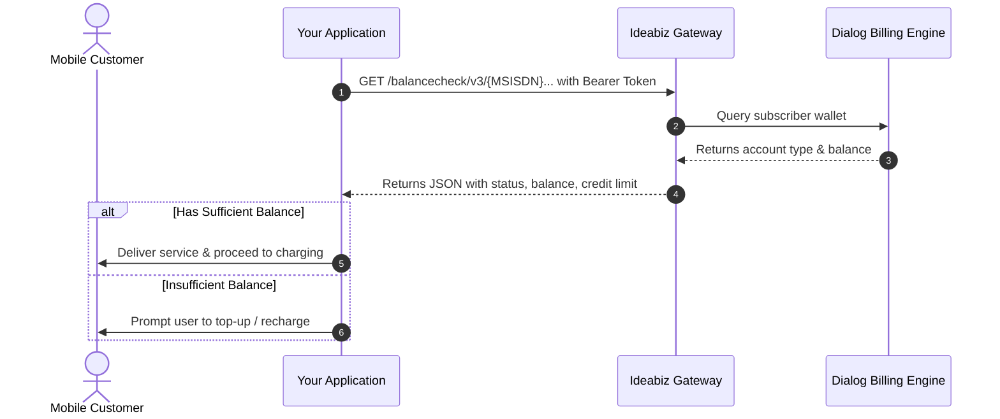

# Balance Check API

> [!NOTE]
> **What is the Balance Check API?**
> The Balance Check API allows your application to check a Dialog customer's account balance and credit limit in real time. Businesses commonly use this before delivering a paid digital service to verify whether the customer has enough credit to be charged successfully.

---

## 1. How It Works (Overview)



---

## 2. Key Concepts & Jargon Buster

- **Prepaid vs. Postpaid**:
  - **PREPAID**: The customer pays in advance. The `balance` field indicates their current available airtime (in LKR).
  - **POSTPAID**: The customer pays monthly. The `creditLimit` indicates their maximum credit ceiling, and `balance` indicates their remaining unbilled credit limit.
- **Plain MSISDN**: Standard mobile number formatted with country code (e.g., `94766691500`).
- **Encrypted MSISDN**: An anonymous alphanumeric token obtained through [Header Enrichment](./Header_Enrichment.md) when the user browses on mobile data.

---

## 3. Prerequisites & Authorization

All API calls to Ideabiz require an OAuth 2.0 Bearer Access Token in the request headers.

> [!TIP]
> Need an Access Token? Follow the [Token Management Guide](../../Getting_Started/Token_Manegment.md) to generate or renew your token.

### Required Request Headers

| Header | Value | Description |
| :--- | :--- | :--- |
| `Authorization` | `Bearer [your_access_token]` | Active 1-hour access token |
| `Accept` | `application/json` | Instructs the server to return JSON |
| `Content-Type` | `application/json` | Standard media type |

---

## 4. Making a Balance Check Request

### HTTP Method
```http
GET
```

### Endpoint URL Template
```http
https://ideabiz.lk/apicall/balancecheck/v3/{MSISDN}/transactions/amount/balance
```

> [!NOTE]
> `/v3/` is the standard production endpoint. `/v4/` is also supported for backwards compatibility.

---

### Formatting the `{MSISDN}` Parameter

The `{MSISDN}` in the URL must be formatted depending on whether you have a **Plain Number** or an **Encrypted Number**:

#### Option A: Using a Plain Mobile Number
- Use standard Sri Lankan international format: `947XXXXXXXX`.
- **Do NOT** include `+`, `tel:`, dashes, or leading zeros.

*Example URL:*
```http
https://ideabiz.lk/apicall/balancecheck/v3/94766691500/transactions/amount/balance
```

#### Option B: Using an Encrypted MSISDN (from Header Enrichment)
- If you detected the user's number via [Header Enrichment](./Header_Enrichment.md), the token must be URL-encoded with the `etel:` prefix.

*Example URL:*
```http
https://ideabiz.lk/apicall/balancecheck/v3/etel:9476-vl%251D%25A3%25F7%25AC%25E1%25AE%25C0%25AD%25FF/transactions/amount/balance
```

---

## 5. API Response Reference

### Successful Response (HTTP 200 OK)

```json
{
    "endUserId": "94766691500",
    "referenceCode": "DLG212005-1500564823863",
    "accountInfo": {
        "accountType": "PREPAID",
        "accountStatus": "Active",
        "creditLimit": 66.81,
        "balance": 66.81
    }
}
```

### Response Field Descriptions

| Field | Type | Description |
| :--- | :--- | :--- |
| `endUserId` | String | The MSISDN queried. |
| `referenceCode` | String | Unique transaction tracking ID generated by Dialog's billing system. |
| `accountInfo.accountType` | String | `PREPAID` or `POSTPAID`. |
| `accountInfo.accountStatus` | String | Status of the SIM card (e.g., `Active`, `Suspended`). |
| `accountInfo.creditLimit` | Number | Maximum credit limit allowed on the account (in LKR). |
| `accountInfo.balance` | Number | Current available balance (in LKR) eligible for transactions. |

---

## 6. Response Codes & Troubleshooting

| HTTP Code | Meaning | What to do? |
| :---: | :--- | :--- |
| **200** | Success | Query was successful; inspect `accountInfo.balance`. |
| **400** | Bad Request | The MSISDN format is invalid or malformed. Verify the number has no `+` sign. |
| **401** | Unauthorized | Your Access Token has expired or is invalid. Refresh your token. |
| **403** | Forbidden | Your Ideabiz application is not subscribed or approved for the Balance Check API. |
| **404** | Not Found | The endpoint URL path is incorrect or the subscriber number was not found. |
| **405** | Method Not Allowed | Ensure you are using HTTP `GET` (not `POST`). |
| **500** | Internal Server Error | Temporary billing engine failure. Retry the request after a short delay. |
| **503** | Service Unavailable / Quota Exceeded | Server is busy or your application has exceeded its API rate limit tier. |

---

## 7. Error & Exception Payloads

### Policy & Server Exceptions
When an error occurs at the business or platform layer, the response will contain an exception structure:

- **Policy Exception (`PLxxxx`)**: Violation of business rules (e.g., invalid subscriber account).
- **Service Exception (`SVCxxxx`)**: Malformed parameters or input format errors.

```json
{
    "requestError": {
        "serviceException": {
            "messageId": "SVC0002",
            "text": "Invalid input value for message part %1",
            "variables": "clientCorrelator Value 12345"
        }
    }
}
```

### Rate Limiting / Quota Fault (HTTP 503)
If you exceed your approved API tier calls-per-second (TPS) or monthly quota:

```json
{
    "fault": {
        "code": "900800",
        "message": "Message Throttled Out",
        "description": "You have exceeded your quota"
    }
}
```
