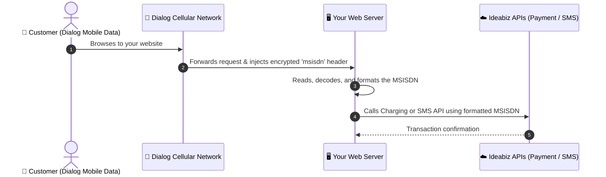

# Header Enrichment (HE)

> [!NOTE]
> **What is Header Enrichment?**
> Header Enrichment allows your website or web application to automatically detect a Dialog customer's mobile number when they visit your site using mobile data. It enables zero-friction, one-click logins and subscription confirmations without requiring users to type their phone number or wait for an SMS OTP.

---

## 1. How It Works (Overview)



> [!IMPORTANT]
> **Key Operational Requirements:**
> 1. **Dialog Mobile Data Only:** The visitor **must** browse using Dialog mobile cellular data (3G/4G/5G). It **will not work over Wi-Fi** or fixed broadband.
> 2. **URL Whitelisting:** You must provide your website URL to the Ideabiz team beforehand so Header Enrichment can be provisioned for your domain/IP.

---

## 2. Key Terminology (Jargon Buster)

- **MSISDN**: The telecom term for a mobile telephone number.
- **Encrypted MSISDN**: For user privacy and security regulations, Dialog does not expose the customer's raw, plain phone number. Instead, a temporary encrypted token is provided. This token is accepted by Ideabiz Payment and SMS APIs.
- **HTTP Header**: Background metadata sent by the browser or network to your server with every web request (like the return address on a letter).
- **Base64 & URL Encoding**: Standard ways to safely transmit special or binary characters across the internet without corruption.

---

## 3. MSISDN Transformation Process

When a customer visits your whitelisted website over Dialog mobile data, Dialog injects an HTTP header named `msisdn`.

Follow this step-by-step transformation pipeline to prepare the token for API usage:

```
Raw Header (Base64) ──> Base64 Decode ──> URL Encode ──> Add Prefix for Ideabiz APIs
```

| Step | Action | Description | Example Output |
| :--- | :--- | :--- | :--- |
| **Step 1** | **Receive Header** | Extract the incoming `msisdn` header from the HTTP request. | `dmwdovap66bFrvw=` |
| **Step 2** | **Base64 Decode** | Decode the Base64-encoded string. | `vl^]£÷¬á®À­ÿ` |
| **Step 3** | **URL Encode** | Apply standard URL encoding to the decoded characters. | `vl%1D%A3%F7%AC%E1%AE%C0%AD%FF` |

---

## 4. Using the MSISDN in Ideabiz API Calls

Depending on where you pass the MSISDN (in a JSON request body or inside the request URL), the formatting rules differ slightly:

### A. In an API Request Body (JSON)
Prepend `etel:+9477-` to the Step 3 URL-encoded value.

*Format:*
```text
etel:+9477-[URL_ENCODED_MSISDN]
```

*Example:*
```text
etel:+9477-vl%1D%A3%F7%AC%E1%AE%C0%AD%FF
```

---

### B. In an API Request URL (Path or Query Parameter)
When placing the MSISDN directly in the URL:
1. Prepend `etel:9477-` *(Note: Do NOT include the `+` sign here)*.
2. URL encode the **entire** resulting string again.

*Format:*
```text
urlencode('etel:9477-[URL_ENCODED_MSISDN]')
```

*Example:*
```text
etel%3A9477-vl%251D%25A3%25F7%25AC%25E1%25AE%25C0%25AD%25FF
```

---

## 5. Dialog Mobile Network IP Ranges

To ensure security and verify that incoming web requests are legitimately originating from Dialog's cellular network, you can check the visitor's IP address against Dialog's mobile IP blocks:

- `175.157.0.0/16`
- `182.161.0.0/19`
- `122.255.44.0/22`

> [!TIP]
> If a visitor's IP falls outside these ranges, they are likely browsing via a broadband Wi-Fi provider or an international connection, and Header Enrichment will not trigger.

---

## 6. How to Test Header Enrichment

Use this test script to verify your setup before integrating with full payment or SMS flows.

### Testing Checklist
- [ ] Upload the script below as `test_he.php` to your whitelisted web server.
- [ ] Take a smartphone equipped with a active **Dialog SIM card**.
- [ ] Turn **OFF Wi-Fi**.
- [ ] Turn **ON Mobile Data**.
- [ ] Open the mobile browser and visit `https://yourdomain.com/test_he.php`.