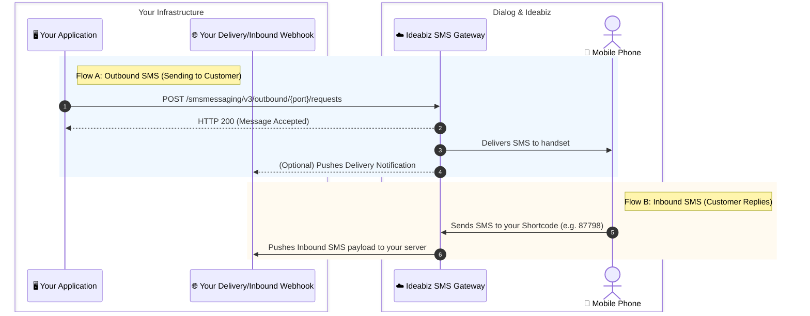

# SMS API

> [!NOTE]
> **What is the SMS API?**
> The Dialog SMS API allows your application to programmatically send SMS messages (One-Way or Two-Way) to mobile subscribers and receive SMS replies sent by customers to your assigned Dialog Shortcode.

---

## 1. How It Works (Message Flows)



---

## 2. Critical: SMS Length & Billing Pitfalls (160 vs. 70 Characters)

> [!WARNING]
> **Avoid Surprise Telecom Charges:**
> Telecom billing is calculated **per 160-character segment**, NOT per API call!
> 
> - **Standard English (GSM 7-bit):** Up to **160 characters** per SMS.
> - **Unicode (Sinhala, Tamil, Special Symbols, Emojis):** Up to **70 characters** per SMS.
> 
> ⚠️ **The Emoji / Local Language Trap:**
> If your message contains even **a single Sinhala character (e.g. `හෙලෝ`), Tamil character (e.g. `வணக்கம்`), or Emoji (e.g. `🎉`)**, the entire SMS switches to Unicode mode (70-char limit). A 150-character message that costs 1 SMS in English will suddenly be charged as **3 separate SMS messages** in Unicode!

---

## 3. Key Concepts & Terminology

- **Port / Shortcode**: A 4 to 6 digit telecom number assigned to your app by Dialog (e.g., `87798`).
- **Sender Mask (`senderName`)**: An approved brand name (up to 11 alphanumeric characters, e.g. `MYBRAND`) displayed as the sender instead of the numeric shortcode. Masks require Dialog business approval.
- **Client Correlator (`clientCorrelator`)**: A unique tracking string generated by your app. If a network timeout occurs and you retry sending, Dialog uses this ID to prevent sending a duplicate SMS to the customer.

---

## 4. Authorization & Headers

All requests require a valid OAuth 2.0 Bearer token. Refer to the [Token Management Guide](../../Getting_Started/Token_Manegment.md).

```http
Content-Type: application/json;charset=UTF-8
Authorization: Bearer [YOUR_ACCESS_TOKEN]
Accept: application/json
```

---

## 5. Sending an SMS (Outbound)

### Request Details
- **Method:** `POST`
- **Endpoint URL:**
  ```http
  https://ideabiz.lk/apicall/smsmessaging/v3/outbound/{port}/requests
  ```
  *(Replace `{port}` with your assigned shortcode, e.g., `87798`)*.

> [!CAUTION]
> **Crucial Rule:** The `{port}` in your URL **must match** the number in `senderAddress` in your JSON body. If your URL has `.../87798/requests`, your body must specify `"senderAddress": "tel:87798"`. A mismatch triggers error `SVC7109`.

### Sample Request Payload
```json
{
    "outboundSMSMessageRequest": {
        "address": [
            "tel:+94766691500"
        ],
        "senderAddress": "tel:87798",
        "outboundSMSTextMessage": {
            "message": "Your verification code is 482910."
        },
        "clientCorrelator": "REQ-100293",
        "senderName": "MYBRAND",
        "receiptRequest": {
            "notifyURL": "https://yourdomain.com/api/sms/delivery-report",
            "callbackData": "order_id_5541"
        }
    }
}
```

### Parameter Reference

| Field | Type | Mandatory? | Description |
| :--- | :---: | :---: | :--- |
| `address` | Array | **Yes** | Destination mobile numbers formatted as `tel:+947XXXXXXXX`. |
| `senderAddress` | String | **Yes** | Your assigned shortcode, formatted as `tel:[SHORTCODE]` (must match URL `{port}`). |
| `message` | String | **Yes** | The text message body. |
| `clientCorrelator` | String | **Yes** | Unique request ID to prevent duplicate sends on network retries. |
| `senderName` | String | Optional | Approved alphanumeric sender mask (max 11 chars, no special symbols). |
| `receiptRequest.notifyURL` | String | Optional | Webhook URL on your server where Dialog sends delivery receipts. |
| `receiptRequest.callbackData` | String | Optional | Custom reference string returned back in the delivery receipt. |

### Successful Response (HTTP 200 OK)
```json
{
    "outboundSMSMessageRequest": {
        "deliveryInfoList": {
            "deliveryInfo": [
                {
                    "address": "tel:+94766691500",
                    "deliveryStatus": "MessageWaiting",
                    "messageReferenceCode": "D-O-42-12f93c0e5b1f470cb03947096f01fef9-1455613873"
                }
            ],
            "resourceURL": "https://ideabiz.lk/apicall/smsmessaging/v3/outbound/87798/requests/D-O-42-12f93c0e5b1f470cb03947096f01fef9"
        },
        "serverReferenceCode": "D-O-42-12f93c0e5b1f470cb03947096f01fef9",
        "address": ["tel:+94766691500"],
        "senderAddress": "tel:87798"
    }
}
```

---

## 6. Receiving Delivery Notifications (Delivery Webhook)

If you specified a `notifyURL` in your send request, Dialog pushes an HTTP POST callback when the SMS reaches the customer's phone:

```json
{
    "deliveryInfoNotification": {
        "callbackData": "order_id_5541",
        "serverReferenceCode": "D-O-46-39524b230e3c4da9b95eb0053f7f",
        "senderAddress": "tel:87798",
        "deliveryInfo": {
            "address": "tel:+94766691500",
            "deliveryStatus": "DeliveredToTerminal",
            "operatorCode": "DIALOG"
        }
    }
}
```

### Common Delivery Status Values
- **`DeliveredToTerminal`**: Successfully delivered to the user's phone.
- **`DeliveredToNetwork`**: Handed over to the mobile carrier network.
- **`DeliveryImpossible`**: Number is invalid, out of service, or blocked.

---

## 7. Receiving Inbound SMS (MO Notifications)

When a customer sends an SMS to your shortcode, Ideabiz forwards the incoming message to your pre-configured inbound webhook URL:

```json
{
    "inboundSMSMessageNotification": {
        "inboundSMSMessage": {
            "dateTime": "2026-10-08 14:30:00",
            "destinationAddress": "tel:87798",
            "messageId": "D-I-42-12f93c0e5b1f0cb03947096f01fef",
            "message": "JOIN PROMO",
            "senderAddress": "94766691500"
        }
    }
}
```

---

## 8. Common Errors & Troubleshooting

| HTTP Code | Error Code | Meaning | Solution |
| :---: | :--- | :--- | :--- |
| **400** | `POL7101` | *Mask not allowed to current application* | The `senderName` specified is not registered or approved for your app. |
| **400** | `SVC0002` | *Invalid input value* | Malformed JSON or invalid phone number formatting. |
| **500** | `SVC7109` | *URL param port and sender address do not match* | Make sure `{port}` in the URL matches `"senderAddress": "tel:{port}"` in the body. |
| **401** | `900903` | *Access Token Expired* | Renew your Bearer access token using the [Refresh Token](../../Getting_Started/Token_Manegment.md). |
| **503** | `900800` | *Message Throttled Out* | Exceeded your rate limit tier (TPS). Slow down request volume. |

---

## 9. Official Code Samples & SDKs

- [PHP Request Handler (GitHub)](https://github.com/ideabizlk/IdeaBiz-Request-Handler---PHP)
- [Java SMS Handler (GitHub)](https://github.com/ideabizlk/IdeaBiz-SMS-API-Handler-JAVA)
- [NodeJS Request Handler (GitHub)](https://github.com/ideabizlk/IdeaBiz-Request-Handler---NodeJS)
- [C# .NET Request Handler (GitHub)](https://github.com/ideabizlk/IdeaBiz-Request-Handler-CSharp)
