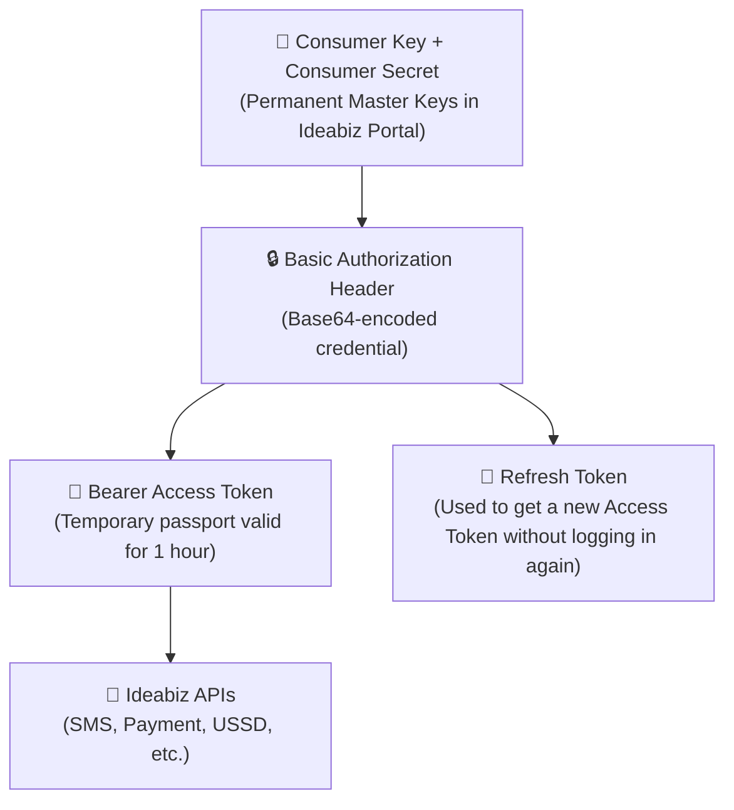

# Generating Your API Keys & Tokens

> [!NOTE]
> **What is this step for?**
> Before you can make any API call on Ideabiz (such as sending an SMS or charging a user), your application must authenticate itself. In this guide, you will learn how to obtain your API credentials from the Ideabiz portal and understand what each key does.

---

## 1. Key Concepts: The Credential Hierarchy

For freshers and newcomers, API security can feel like a maze of different keys. Here is how they relate to one another:



| Credential | What is it? | How long does it last? | Where is it used? |
| :--- | :--- | :--- | :--- |
| **Consumer Key** | Your application's public identifier | Permanent | Used together with the Consumer Secret to identify your app. |
| **Consumer Secret** | Your application's private master password | Permanent *(Keep confidential!)* | Never share this publicly or commit it to GitHub. |
| **Basic Auth Code** | `Base64(ConsumerKey:ConsumerSecret)` | Permanent | Passed to the Token API to generate access tokens. |
| **Access Token** | A temporary token starting with `Bearer ...` | **1 Hour (3,600 seconds)** | Included in every single API call header. |
| **Refresh Token** | A special token tied to your access token | Long-lived | Used to get a new Access Token when the current one expires. |

---

## 2. Step-by-Step: Obtaining Your Keys from the Portal

1. Log in to your account at [Ideabiz Portal](https://www.ideabiz.lk).
2. Navigate to **My Subscriptions**.
3. Select your registered application from the **Application with Subscription** dropdown menu.
4. Under the **Keys - Production** tab:
   - Click **Generate Keys** (if generating for the first time).
   - You will see your **Consumer Key** and **Consumer Secret**.
   - You will also see an initial **Access Token** and **Refresh Token**.

> [!WARNING]
> Keep your **Consumer Secret** strictly confidential. Anyone with access to this secret can make API calls on your account and incur billing charges.

---

## 3. How to Create the Basic Authorization Code Safely

To request or refresh tokens programmatically, you need to combine your Consumer Key and Consumer Secret with a colon (`:`) and convert it to Base64:

```text
Format:    ConsumerKey:ConsumerSecret
Example:   yYHg657Hbshsnadnsh:uahH&GASJ87380208Hgah
Result:    eVlIZzY1N0hic2hzbmFkbnNoOnVhaEgmR0FTSjg3MzgwMjA4SGdhaA==
```

> [!CAUTION]
> **Security Notice:** Do not paste your production credentials into public online Base64 websites, as your secrets can be logged by third parties.

### Safe Methods to Encode:

#### Option A: In Postman (Automatic)
In Postman, you don't even need to encode it manually!
1. Go to the **Authorization** tab.
2. Select **Type: Basic Auth**.
3. Enter your **Consumer Key** as the *Username*.
4. Enter your **Consumer Secret** as the *Password*.
5. Postman will automatically calculate and send the Base64 header for you.

#### Option B: In Command Line / Terminal
- **Windows (PowerShell):**
  ```powershell
  [Convert]::ToBase64String([Text.Encoding]::UTF8.GetBytes("YOUR_KEY:YOUR_SECRET"))
  ```
- **macOS / Linux:**
  ```bash
  echo -n "YOUR_KEY:YOUR_SECRET" | base64
  ```

---

## 4. Next Step

Now that you have your credentials and understand the token hierarchy, proceed to the Token Management guide to learn how to request and renew tokens in your code or in Postman.

👉 **[Go to Token Management Guide](./Token_Manegment.md)**