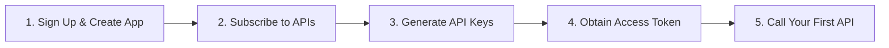

# Welcome to Ideabiz API Documentation

Ideabiz is the digital enablement API platform by **Dialog Axiata PLC**. It allows businesses, developers, and partners to connect with Dialog's telecom infrastructure to send SMS, process mobile payments, verify subscriber identities, and build rich digital experiences.

---

## Quick Start Guide for Newcomers

If you are new to Ideabiz or starting your first integration, follow these steps in order:

| Step | Guide | Description |
| :---: | :--- | :--- |
| **1** | [Creating Applications](./Getting_Started/Creating_Applications.md) | Register your business application and define callback URLs. |
| **2** | [API Configuration](./Getting_Started/API_config.md) | Choose the APIs you need (SMS, Payment, USSD) and get them approved. |
| **3** | [Generating API Keys](./Getting_Started/Generate_Token.md) | Locate your Consumer Key and Consumer Secret in the Ideabiz Portal. |
| **4** | [Token Management](./Getting_Started/Token_Manegment.md) | Learn how to generate and refresh OAuth 2.0 Bearer tokens. |
| **Reference** | [**Telecom & API Glossary**](./Getting_Started/Glossary.md) | **Must-read for non-technical freshers:** Plain-English explanations of all telecom acronyms. |

---

## Core APIs Directory

Explore the most popular APIs available on the Ideabiz platform:

- **Messaging:**
  - [SMS API](./APIs/Main/SMS.md) – Send notifications, OTPs, and receive inbound messages.
  - [USSD API](./APIs/Main/USSD.md) – Build interactive real-time text menus (e.g., `#777#`).
- **Identity & Seamless Access:**
  - [Header Enrichment](./APIs/Main/Header_Enrichment.md) – Seamless 1-click mobile subscriber identification.
  - [Balance Check API](./APIs/Main/Balance_Check.md) – Check customer airtime balance or credit limit before charging.
- **Payments & Wallets:**
  - [Payment API](./APIs/Main/Payment.md) – Direct operator billing on mobile airtime / postpaid bills.
  - [eZ Cash Agent API](./APIs/Main/eZ_Cash_Agent_API-V2.md) – Mobile money transactions and agent services.
  - [Web Payment](./APIs/Main/Web_Payment.md) / [PIN Payment](./APIs/Main/PIN-Payment.md) – Browser-based checkout experiences.

---

## Developer Support & Assistance

Need help or experiencing an issue?
- **Support Guide:** [Contact Us](./Support/Contact%20Us.md)
- **Phone:** +94 767 222 161 *(Business Hours: Mon–Fri 8:30 AM – 5:00 PM IST)*
- **Email:** support@ideabiz.lk
